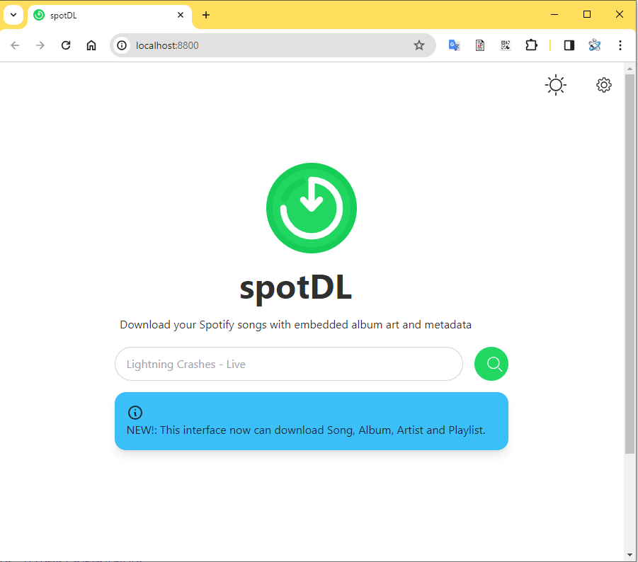

# spotify-downloader-ui

**spotify-downloader-ui** is a Docker image that runs the web interface of
[spotDL](https://github.com/spotDL/spotify-downloader) (`spotdl web`), the open-source tool that
finds songs from Spotify links or searches on YouTube and downloads them with album art, lyrics and
metadata. Start one container, open the browser, and download music to a mapped folder without
installing Python, spotDL or FFmpeg on the host.

This project only packages spotDL. All downloading, searching and tagging is done by spotDL itself.



## Table of contents

- [Features](#features)
- [How it works](#how-it-works)
- [Requirements](#requirements)
- [Installation](#installation)
- [Configuration](#configuration)
- [Usage](#usage)
- [Published images](#published-images)
- [Updating spotDL](#updating-spotdl)
- [Troubleshooting](#troubleshooting)
- [Security notes](#security-notes)
- [Legal and responsible use](#legal-and-responsible-use)
- [Development](#development)
- [Contributing](#contributing)
- [Credits](#credits)
- [License](#license)

## Features

- Runs the official spotDL web UI (`spotdl web`) in a container, reachable from any browser on
  your network.
- Search for a song or paste a Spotify link, then download the result from the browser.
- spotDL finds a matching track with its audio provider (YouTube Music by default; YouTube,
  SoundCloud, Bandcamp and Piped can be chosen in the settings) and embeds the album art and
  metadata into the downloaded file.
- A settings panel (gear icon) provided by the spotDL web UI. The currently published images
  (spotDL 4.2.4) also have a light/dark theme toggle; newer spotDL releases (4.5.x) have hidden it.
- Downloads are written to `/app/downloads`, which you map to a folder on the host.
- FFmpeg is preinstalled in the image, which spotDL needs for audio conversion.
- Multi-architecture images for `linux/amd64`, `linux/arm64` and `linux/arm/v7`
  (for example, Raspberry Pi).

The spotDL web UI has fewer options than the spotDL command line. See the
[spotDL documentation](https://github.com/spotDL/spotify-downloader#readme) for what each spotDL
version supports.

## How it works

The image is built from the [`Dockerfile`](Dockerfile) in this repository:

- **Base image:** `python:latest` (Debian-based), which is not pinned. spotDL 4.x supports
  Python 3.10 to 3.14, so a rebuild only works while `python:latest` stays in that range (see
  [Updating spotDL](#updating-spotdl)).
- **System packages:** `ffmpeg`, `gnupg2`, `curl`, `unzip`.
- **Python packages:** `spotdl`, installed from PyPI via [`requirements.txt`](requirements.txt).
  The version is **not pinned**, so every image build installs the latest spotDL release
  available at build time.
- **Directories:** `/app/downloads` (download target) and `/root/.spotdl` (spotDL's settings and
  cache folder).
- **Environment:** `PYTHONIOENCODING=utf-8` and `LANG=C.UTF-8`, so song titles with non-ASCII
  characters are handled correctly.
- **Command:**

  ```sh
  spotdl web --host 0.0.0.0 --keep-alive --web-use-output-dir --output /app/downloads
  ```

  | Flag | Effect |
  |------|--------|
  | `--host 0.0.0.0` | Listen on all interfaces, so the UI is reachable from outside the container (spotDL's default is `localhost`). |
  | `--keep-alive` | Keep the web server running when no browser is connected. |
  | `--web-use-output-dir` | Save files to the output directory instead of a per-session folder. |
  | `--output /app/downloads` | The output directory, which is the mapped volume. |

  No `--port` is passed, so spotDL uses its default port, **8800**.

## Requirements

- Docker (and optionally Docker Compose).
- Outbound internet access from the container (Spotify metadata and YouTube downloads).
- A host folder for the downloaded files.

No Spotify account or API key is required: spotDL ships with its own default Spotify client
credentials.

## Installation

### Docker Compose

Create a `docker-compose.yaml` (or use the one in this repository):

```yaml
services:
  spotify-downloader-ui:
    image: techblog/spotify-downloader-ui:latest
    container_name: spotify-downloader-ui
    restart: always
    volumes:
      - ./spotify-downloader-ui/downloads:/app/downloads
    ports:
      - "8800:8800"
```

Start it:

```sh
docker compose up -d
```

### Docker run

```sh
docker run -d \
  --name spotify-downloader-ui \
  --restart always \
  -p 8800:8800 \
  -v "$(pwd)/spotify-downloader-ui/downloads:/app/downloads" \
  techblog/spotify-downloader-ui:latest
```

Then open `http://<docker-host>:8800` in your browser.

## Configuration

### Ports

| Container port | Description |
|----------------|-------------|
| `8800` | spotDL web UI (HTTP). |

The port inside the container is fixed at 8800 by the image's command. To use a different port on
the host, change only the left side of the mapping, for example `"8080:8800"`.

### Volumes

| Container path | Description |
|----------------|-------------|
| `/app/downloads` | Where downloaded songs are saved. Map it to a host folder. |
| `/root/.spotdl` | spotDL's settings and cache folder. Optional; mapping it is not needed for normal use. |

### Environment variables

The image sets these variables. None of them needs to be changed.

| Variable | Default | Description |
|----------|---------|-------------|
| `PYTHONIOENCODING` | `utf-8` | Python I/O encoding. spotDL suggests this setting when it hits encoding errors. |
| `LANG` | `C.UTF-8` | System locale. |
| `API_KEY` | *(empty)* | Declared in the Dockerfile but **not used** by the image or by spotDL. Setting it has no effect. |

The settings panel lets you pick the audio provider, lyrics provider and output format; other
spotDL options can't be changed without changing the image's command. The image does not read
any extra environment variables for them.

## Usage

1. Open `http://<docker-host>:8800`.
2. Type a song name, or paste a Spotify link, into the search box and search.
3. Start the download from the results. The file is saved to the host folder mapped to
   `/app/downloads`.
4. Use the gear icon (top right) to change the audio provider, lyrics provider and output format.
   In the currently published images (spotDL 4.2.4), the sun icon switches between light and dark
   mode.

Because the container runs with `--web-use-output-dir`, everyone using the UI shares the same
download folder. spotDL warns that this can cause problems when several users use the web UI at
the same time.

## Published images

Images are published to Docker Hub as
[`techblog/spotify-downloader-ui`](https://hub.docker.com/r/techblog/spotify-downloader-ui).

| Tag | Platforms | Last pushed |
|-----|-----------|-------------|
| `latest` | `linux/amd64`, `linux/arm64`, `linux/arm/v7` | 2024-02-04 |
| `1.0.0` | `linux/amd64`, `linux/arm64`, `linux/arm/v7` | 2024-02-04 |

The [`VERSION`](VERSION) file currently says `1.1.0`, but no `1.1.0` image has been published yet.
There are no GitHub releases or git tags; the image tag comes from the `VERSION` file.

Each published image contains the spotDL version that was current when it was built.

## Updating spotDL

spotDL is not pinned, so the spotDL version inside an image is whatever was newest when that image
was built.

- **Pull a newer published image** (only helps if the image was rebuilt after the spotDL release
  you want):

  ```sh
  docker compose pull
  docker compose up -d
  ```

- **Build the image yourself** to get the latest spotDL right now:

  ```sh
  docker build --pull --no-cache -t spotify-downloader-ui .
  ```

  `--no-cache` makes sure the `pip install` step runs again instead of reusing a cached layer
  with an older spotDL. Then point your compose file or `docker run` command at
  `spotify-downloader-ui` instead of `techblog/spotify-downloader-ui:latest`.

  **Python version:** the Dockerfile uses the unpinned `python:latest` base image, and spotDL 4.x
  supports Python 3.10 to 3.14. Today `python:latest` is 3.14, so rebuilds work. Once it moves to
  Python 3.15, the unpinned `pip install spotdl` resolves to spotDL 3.9.6, which has no `web`
  command, and the container fails to start.

To check which spotDL version a running container has:

```sh
docker exec spotify-downloader-ui spotdl --version
```

## Troubleshooting

- **The UI does not load.** Make sure you map a host port to container port `8800`
  (for example `"8800:8800"`). The container always listens on 8800.
- **Downloaded files are owned by root on the host.** The container runs as `root`, so files in
  the mapped downloads folder are created as `root`. Change their ownership on the host
  (`sudo chown -R $USER: ./spotify-downloader-ui/downloads`) if needed.
- **Some songs fail to download.** spotDL downloads through yt-dlp, and its documentation
  recommends installing Deno because some YouTube videos cannot be downloaded without it. The
  image does not include Deno. Downloads can also fail after changes on YouTube's side; updating
  to a newer spotDL (see [Updating spotDL](#updating-spotdl)) often helps.
- **A self-built container exits right away or reports an unknown `web` command.** The image was
  probably built on a `python:latest` newer than 3.14, so pip installed spotDL 3.9.6, which has
  no web UI. Check with `docker exec spotify-downloader-ui spotdl --version`, and build on a base
  image with Python 3.10 to 3.14 (see [Updating spotDL](#updating-spotdl)).
- **Encoding errors with non-English titles.** The image already sets `PYTHONIOENCODING=utf-8`
  and `LANG=C.UTF-8`; keep them if you override the environment.

## Security notes

- **The web UI has no authentication.** Anyone who can reach port 8800 can use it to download
  files to your server.
- **Do not expose it to the internet.** Keep it on a trusted local network, or put it behind a
  reverse proxy that adds authentication and HTTPS.
- **The container runs as `root`.** Only mount the folders it needs.

## Legal and responsible use

spotDL does not download audio from Spotify. It uses Spotify only for track metadata, and it finds
and downloads the audio from other sources: YouTube Music by default, or YouTube, SoundCloud,
Bandcamp or Piped when chosen in the settings.

Downloading music may be subject to Spotify's and YouTube's terms of service and to the copyright
law in your country. You are responsible for how you use this software. Only download content you
have the right to download.

This project is not affiliated with, endorsed by, or connected to Spotify, YouTube, or the spotDL
project.

## Development

### Project layout

| File | Purpose |
|------|---------|
| `Dockerfile` | Builds the image (Python, FFmpeg, spotDL, start command). |
| `requirements.txt` | Python dependencies (`spotdl`, unpinned). |
| `docker-compose.yaml` | Example Compose file. |
| `VERSION` | Image version, used as the Docker Hub tag. |
| `.github/workflows/docker-image.yml` | CI workflow that builds and publishes the image. |
| `screenshots/` | README screenshot. |

### Build and run locally

```sh
docker build -t spotify-downloader-ui .
docker run --rm -p 8800:8800 -v "$(pwd)/downloads:/app/downloads" spotify-downloader-ui
```

### CI workflow

[`.github/workflows/docker-image.yml`](.github/workflows/docker-image.yml) ("Docker Build") runs
manually (`workflow_dispatch`). It builds the image with Docker Buildx and QEMU for
`linux/amd64`, `linux/arm64` and `linux/arm/v7`, and pushes two tags to Docker Hub:
`techblog/spotify-downloader-ui:latest` and `techblog/spotify-downloader-ui:<VERSION>`, where
`<VERSION>` is read from the `VERSION` file.

It needs the repository secrets `DOCKERHUB_USERNAME` and `DOCKERHUB_TOKEN`.

## Contributing

Issues and pull requests are welcome. For problems with downloading, search results or the web UI
itself, check the [spotDL issue tracker](https://github.com/spotDL/spotify-downloader/issues)
first, since this repository only packages spotDL.

## Credits

All the actual work is done by [spotDL](https://github.com/spotDL/spotify-downloader)
(`spotdl` on [PyPI](https://pypi.org/project/spotdl/)), developed by the spotDL team and released
under the [MIT License](https://github.com/spotDL/spotify-downloader/blob/master/LICENSE).

## License

This repository has no `LICENSE` file, so no license has been granted for its contents.
spotDL, which the image installs, is licensed under the MIT License.
