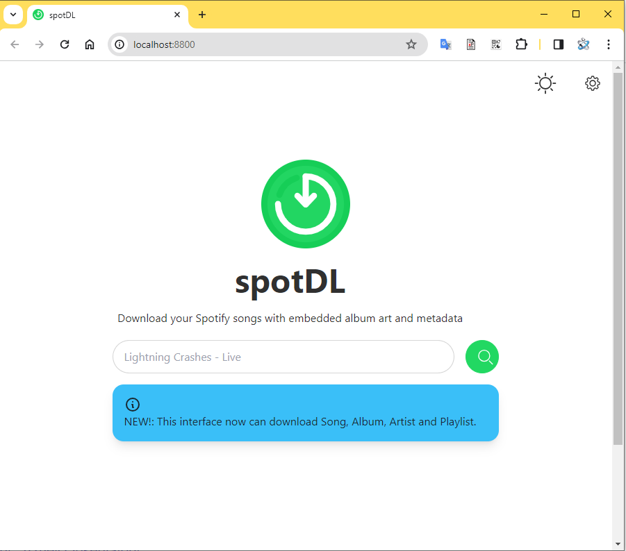

# spotify-downloader-ui
spotify-downloader-ui is a docker container running a web interface of the following amaizing project called ***[spotify-downloader](https://github.com/spotDL/spotify-downloader)***.

## Installation
**spotify-downloader-ui** can be installed using docker-compose

```yaml

version: "3.7"

services:

  spotify-downloader-ui:
    image: techblog/spotify-downloader-ui
    container_name: spotify-downloader-ui
    restart: always
    volumes:
      - ./spotify-downloader-ui/downloads:/app/downloads
    ports:
      - "8800:8800"
```

* **ports:** - The default internal port is 8800, but you can map it to any other port.
* **volumes** - Map your path for the downloaded files.

